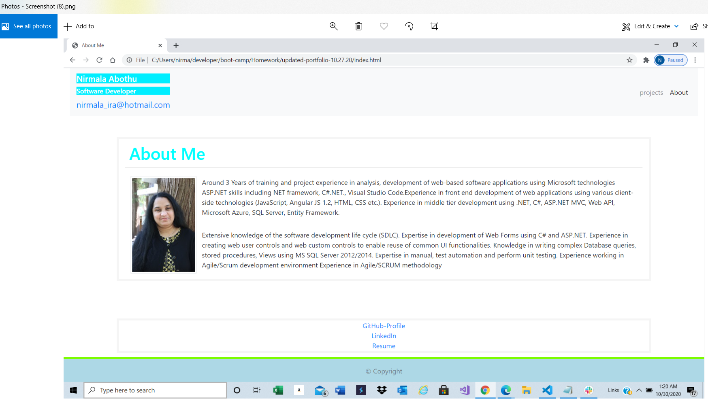
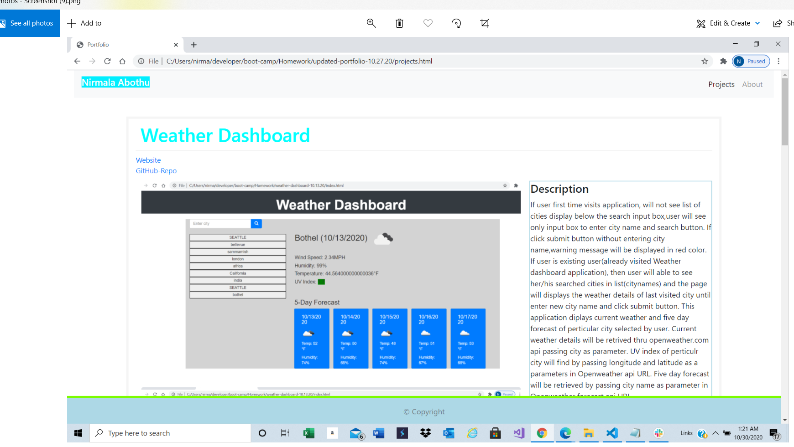
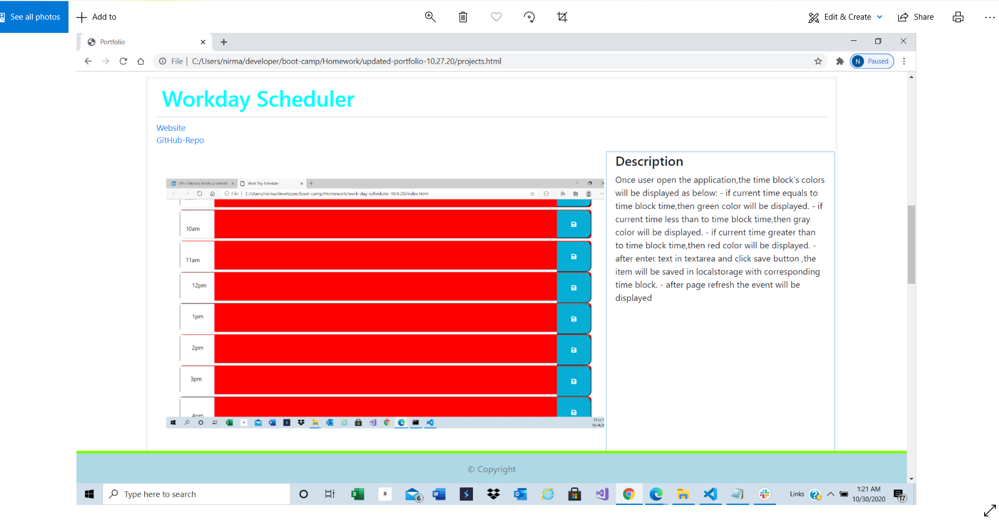
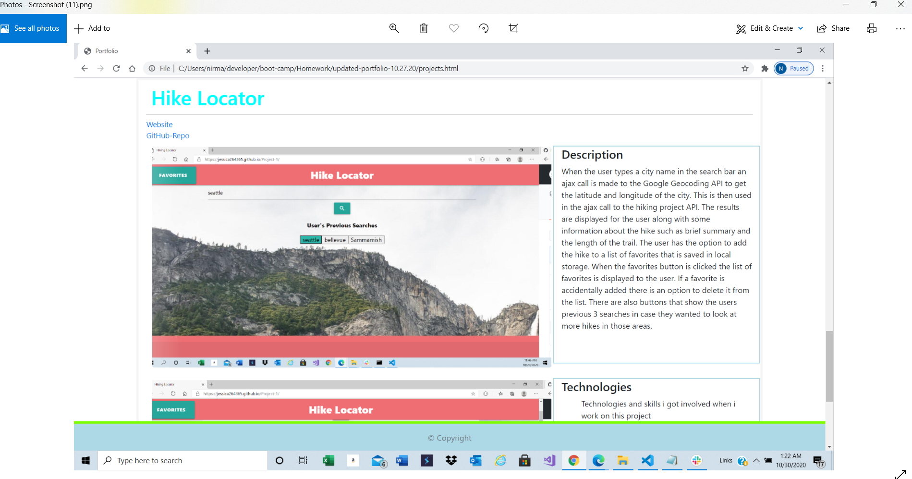

# updated-portfolio-10.27.20

---

## About The Project

---

Updated existing portfolio project with following:

1. [GitHub Profile](https://github.com/NirmalaAbothu)
2. [Updated Resume](Assets//Resume/Resume*Nirmala* Abothu_R.pdf)
3. [LinkedIn](https://www.linkedin.com/in/nirmala-abothu-170a7435/)

To get a local copy up and running follow below steps.

## Prerequisites

None

## Installation

Clone the repo
git clone git@github.com:NirmalaAbothu/updated-portfolio-10.27.20.git

## License & copyright

Copyright © 2020 Nirmala Abothu

## Deployed project link

[Updated-Portfolio](https://nirmalaabothu.github.io/updated-portfolio-10.27.20/)
